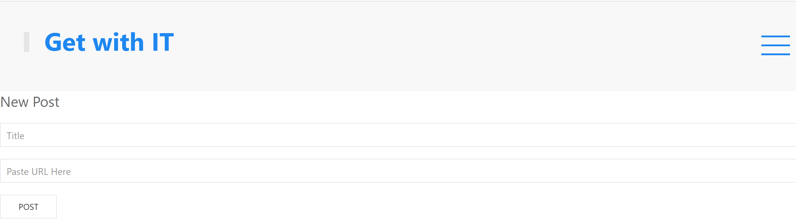

  # Get with IT 
  
  Get with IT is an interactive blog site built with express routes and mysql database.Featuring authentication and user signin.
  
  ## Table of Contents
  * [Installation](#installation)
  * [Usage](#usage)
  * [License](#license)
  * [Contributing](#Contributing)
  * [Tests](#Tests)
  * [Questions](#Questions)
  
  
  ## Installation
  To run on personal server one must first install dependancies.
  
       
       npm install

       
    
  ## Usage
  To initiat connection on local port run server.js
  undefined
  ## License
  No License
  ## Contributing
  If one would like to contribute, please open an issue or contact email below.
  ## Tests
  to test run the jest testing suite
  ## Questions
  [Email](mailto:emailcodydiab@gmail.com)

  [GitHub](https://github.com/CodyDiab)

 [Deployed Application]()